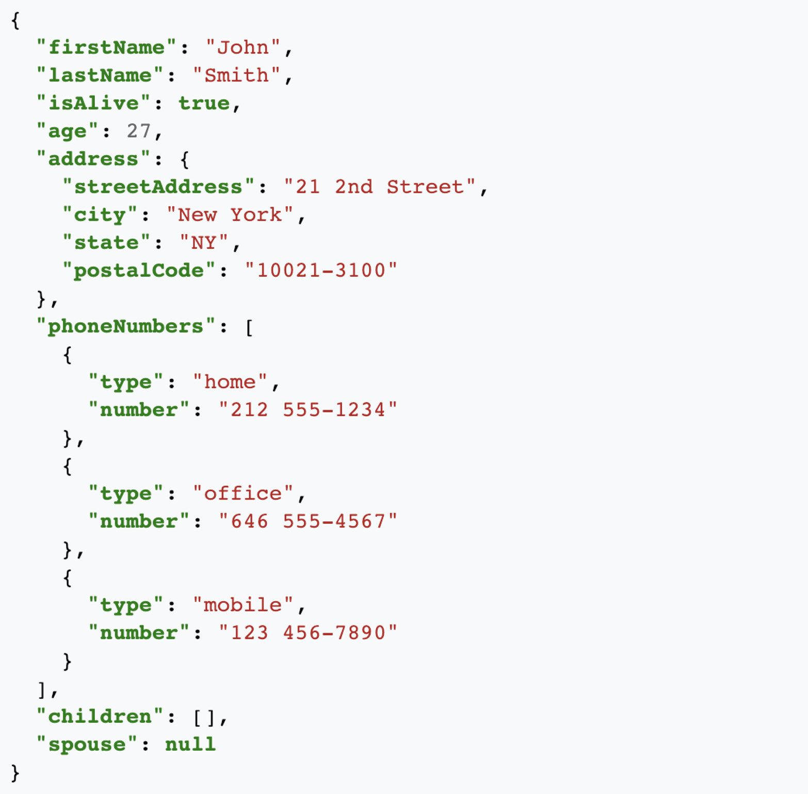
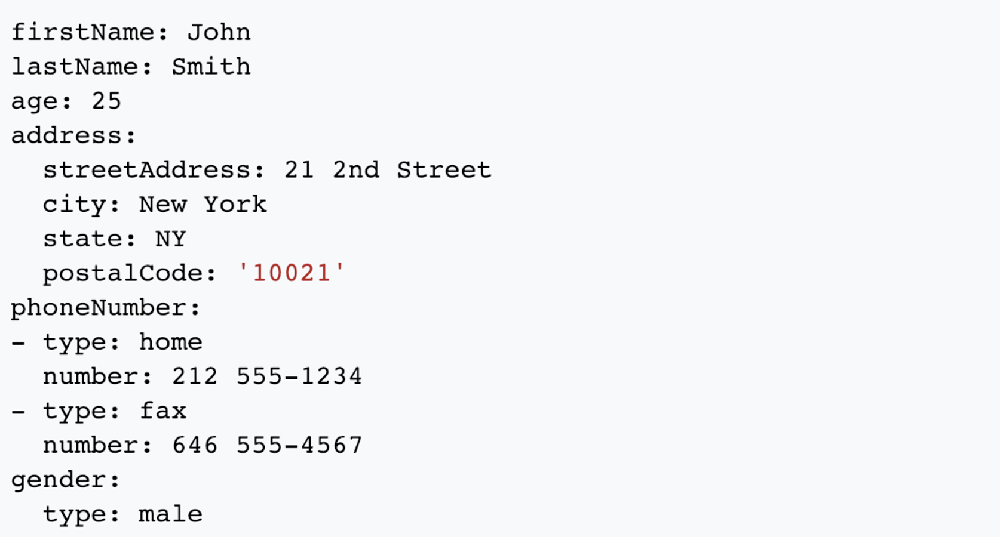

#Introduction to NetOps

Welcome to our four-part series on NetOps technologies. Let's dive right in.

## NetOps Part 1

### Introduction to API

An application programming interface (API) is a set of rules that allow programs to talk to one another.  Web developers create APIs on the server-side and allow clients to communicate with it using HTTP or HTTPS requests.

REST stands for “Representational State Transfer”.  It is a set of rules that developers follow when they create their API. One of these rules states that you should be able to get a resource when you link to a URL.

The URL is called a request while the data returned is called a response.

The endpoint is the starting point of the API you’re requesting from.  As an example, let’s look at the Star Wars API:
[https://swapi.dev/]()

The path determines the resource you’re requesting:
[https://swapi.dev/api/people/1/]()

The request returns a response in JSON format:

~~~
{
    "name": "Luke Skywalker",
    "height": "172",
    "mass": "77",
    "hair_color": "blond",
    "skin_color": "fair",
    "eye_color": "blue",
    "birth_year": "19BBY",
    "gender": "male",
    "homeworld": "https://swapi.dev/api/planets/1/",
    "films": [
        "https://swapi.dev/api/films/1/",
        "https://swapi.dev/api/films/2/",
        "https://swapi.dev/api/films/3/",
        "https://swapi.dev/api/films/6/"
    ],
    "species": [],
    "vehicles": [
        "https://swapi.dev/api/vehicles/14/",
        "https://swapi.dev/api/vehicles/30/"
    ],
    "starships": [
        "https://swapi.dev/api/starships/12/",
        "https://swapi.dev/api/starships/22/"
    ],
    "created": "2014-12-09T13:50:51.644000Z",
    "edited": "2014-12-20T21:17:56.891000Z",
    "url": "https://swapi.dev/api/people/1/"
}
~~~

More info about REST can be found here: [https://en.wikipedia.org/wiki/Representational_state_transfer]()

## JSON

JavaScript Object Notation (JSON) is an open-standard file format that uses human-readable text to transmit data objects consisting of attribute–value pairs and array data types.  It is a very common data format used for asynchronous browser–server communication, including as a replacement for XML. 
JSON is a language-independent data format. It was derived from JavaScript, but as of 2017 many programming languages include code to generate and parse JSON-format data. The official Internet media type for JSON is application/json. JSON filenames use the extension: .json.

###JSON's basic data types are:
**Number:** a signed decimal number
 
**String:** a sequence of Unicode characters. Strings are delimited with double-quotation marks and support a backslash escaping syntax.

**Boolean:** true or false

**Array:** an ordered list of values, each of which may be of any type. Arrays use square bracket notation and elements are comma-separated.

**Object:** an unordered collection of name-value pairs where the names (also called keys) are strings. Since objects are intended to represent associative arrays, it is recommended, though not required, that each key is unique within an object. Objects are delimited with curly brackets and use commas to separate each pair, while within each pair the colon ':' character separates the key or name from its value.

**null:** An empty value, using the word null
Limited whitespace is allowed and ignored around or between syntactic elements (values and punctuation, but not within a string value). Only four specific characters are considered whitespace for this purpose: space, horizontal tab, line feed, and carriage return.  JSON does not provide syntax for comments.

The following example shows a possible JSON representation describing a person:

JSON is promoted as a low-overhead alternative to XML as both of these formats have widespread support for creation, reading, and decoding in the real-world situations where they are commonly used.  Apart from XML, examples could include YAML and CSV. 

### YAML

YAML version 1.2 is a superset of JSON.  For example, escaping a slash (/) with a backslash (\) is valid in JSON, but was not valid in YAML.  Many YAML parsers can natively parse the output from many JSON encoders.
The JSON code above is also entirely valid YAML. YAML also offers an alternative syntax intended to be more human-accessible by replacing nested delimiters like {}, [], and " marks with off-side indentation.

SAMPLE YAML:
 
 

The YAML file above represents the same data set using spacing as delimiters.  

[https://en.wikipedia.org/wiki/JSON]()

## HTTP
HTTP is the primary transport for RESTful API calls.  The HTTP method defines how the client exchanges or requests data from the server.

###HTTP Methods

Method  | Description
------------- | -------------
**GET**  | The GET method requests a representation of the specified resource. Requests using GET should only retrieve data.
**HEAD** | The HEAD method asks for a response identical to that of a GET request, but without the response body.
**POST** | The POST method is used to submit an entity to the specified resource, often causing a change in state or side effects on the server.
**PUT** | The PUT method replaces all current representations of the target resource with the request payload.
**DELETE** | The DELETE method deletes the specified resource.
**CONNECT** | The CONNECT method establishes a tunnel to the server identified by the target resource.
**OPTIONS** | The OPTIONS method is used to describe the communication options for the target resource.
**TRACE** | The TRACE method performs a message loop-back test along the path to the target resource.
**PATCH** | The PATCH method is used to apply partial modifications to a resource.

[https://developer.mozilla.org/en-US/docs/Web/HTTP/Methods]()

###Server Response Codes###

Upon receividng a request, a server will respond with one of the following messages and requested content if applicable:

Code | Meaning
-----| ----- 
**2XX:** | OK: Here’s your page
**3XX:** | REDIRECT: I’m sending you somewhere else
**4XX:** | PAGE NOT FOUND: I don’t have what you asked for
**5XX:** | INTERNAL SERVER ERROR: I’m borked.

[https://en.wikipedia.org/wiki/List_of_HTTP_status_codes]()

##Version Management
A component of software configuration management, version control, also known as revision control or source control, is the management of changes to documents, computer programs, large web sites, and other collections of information. Changes are usually identified by a number or letter code, termed the "revision number", "revision level", or simply "revision". For example, an initial set of files is "revision 1". When the first change is made, the resulting set is "revision 2", and so on. Each revision is associated with a timestamp and the person making the change. Revisions can be compared, restored, and with some types of files, merged.
The need for a logical way to organize and control revisions has existed for almost as long as writing has existed, but revision control became much more important, and complicated when the era of computing began. The numbering of book editions and of specification revisions are examples that date back to the print-only era. Today, the most capable (as well as complex) revision control systems are those used in software development, where a team of people may concurrently make changes to the same files.

###GIT
Git is a version-control system for tracking changes in computer files and coordinating work on those files among multiple people. It is primarily used for source-code management in software development, but it can be used to keep track of changes in any set of files. As a distributed revision-control system, it is aimed at speed, data integrity, and support for distributed, non-linear workflows. Git was created by Linus Torvalds in 2005 for development of the Linux kernel, with other kernel developers contributing to its initial development. As with most other distributed version-control systems, and unlike most client–server systems, every Git directory on every computer is a full-fledged repository with complete history and full version-tracking abilities, independent of network access or a central server. Git is free and open-source software distributed under the terms of the GNU General Public License version 2.
###GitHub
GitHub Inc. is a web-based hosting service for version control using Git. It is mostly used for computer code. It offers all of the distributed version control and source code management (SCM) functionality of Git as well as adding its own features. It provides access control and several collaboration features such as bug tracking, feature requests, task management, and wikis for every project. With over 28 million users, GitHub offers both private repositories and free accounts. In October of 2018, GitHub was acquired by Microsoft. 

[https://en.wikipedia.org/wiki/Version_control]()
[https://en.wikipedia.org/wiki/Git]()
[https://en.wikipedia.org/wiki/GitHub]()

##GIT Exercise

If you haven't already, verify that you have git installed. Type git in a Terminal. If your output is similar to the following, you are good to go:

~~~
$ git
usage: git [--version] [--help] [-C <path>] [-c <name>=<value>]
           [--exec-path[=<path>]] [--html-path] [--man-path] [--info-path]
           [-p | --paginate | -P | --no-pager] [--no-replace-objects] [--bare]
           [--git-dir=<path>] [--work-tree=<path>] [--namespace=<name>]
           <command> [<args>]

These are common Git commands used in various situations:

start a working area (see also: git help tutorial)
   clone     Clone a repository into a new directory
   init      Create an empty Git repository or reinitialize an existing one

work on the current change (see also: git help everyday)
   add       Add file contents to the index
   mv        Move or rename a file, a directory, or a symlink
   restore   Restore working tree files
   rm        Remove files from the working tree and from the index

examine the history and state (see also: git help revisions)
   bisect    Use binary search to find the commit that introduced a bug
   diff      Show changes between commits, commit and working tree, etc
   grep      Print lines matching a pattern
   log       Show commit logs
   show      Show various types of objects
   status    Show the working tree status

grow, mark and tweak your common history
   branch    List, create, or delete branches
   commit    Record changes to the repository
   merge     Join two or more development histories together
   rebase    Reapply commits on top of another base tip
   reset     Reset current HEAD to the specified state
   switch    Switch branches
   tag       Create, list, delete or verify a tag object signed with GPG

collaborate (see also: git help workflows)
   fetch     Download objects and refs from another repository
   pull      Fetch from and integrate with another repository or a local branch
   push      Update remote refs along with associated objects

'git help -a' and 'git help -g' list available subcommands and some
concept guides. See 'git help <command>' or 'git help <concept>'
to read about a specific subcommand or concept.
See 'git help git' for an overview of the system.
~~~

###If you need to install git:

[https://git-scm.com/book/en/v2/Getting-Started-Installing-Git](https://git-scm.com/book/en/v2/Getting-Started-Installing-Git)

Once installed, you should be able to reproduce the output above.

###Create a local repository

Let's start a new project and track files in a repository. In a terminal, enter the following commands:

**Make a directory:**

~~~
$ mkdir test_repo
~~~

**Change to the new directory:**

~~~
$ cd test_repo
~~~

**Initialize the new repository with git:**

~~~
$ git init
Initialized empty Git repository in /Users/jeremypierson/test_repo/.git/
$ 
~~~

###Too Easy?  Want More?

####Here are a few challenges to try:

Repeat the lab above using the GitHub desktop.  Some like the simplicity of the GUI, some like the speed of the CLI.  You choose.  

GitHub Hello World
[https://guides.github.com/activities/hello-world/
]()

Learn Git branching
[https://learngitbranching.js.org/
]()

####Git Resources

Git – the simple guide
[http://rogerdudler.github.io/git-guide/
]()

GitHub Learning Lab:
[https://lab.github.com/
]()

CLI cheat sheet here:
[https://services.github.com/on-demand/downloads/github-git-cheat-sheet.pdf
]()

Pro GIT ebook:
[https://github.com/progit/progit2/releases/download/2.1.102/progit.pdf
]()

